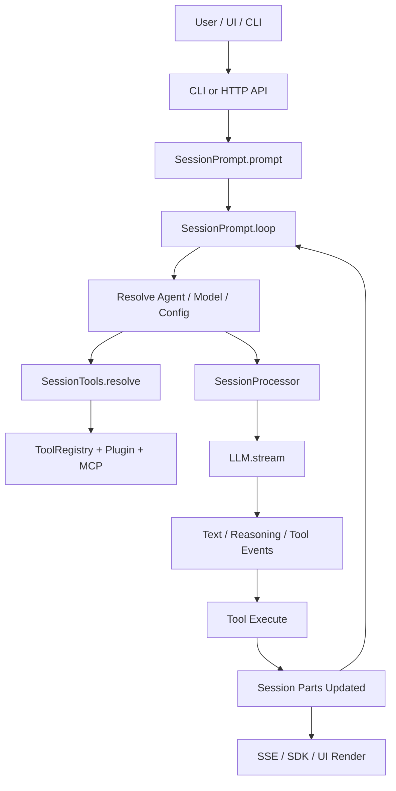
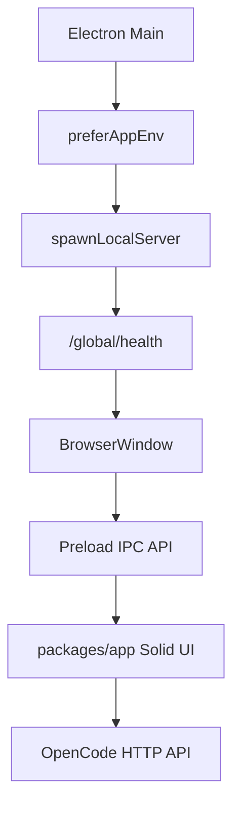
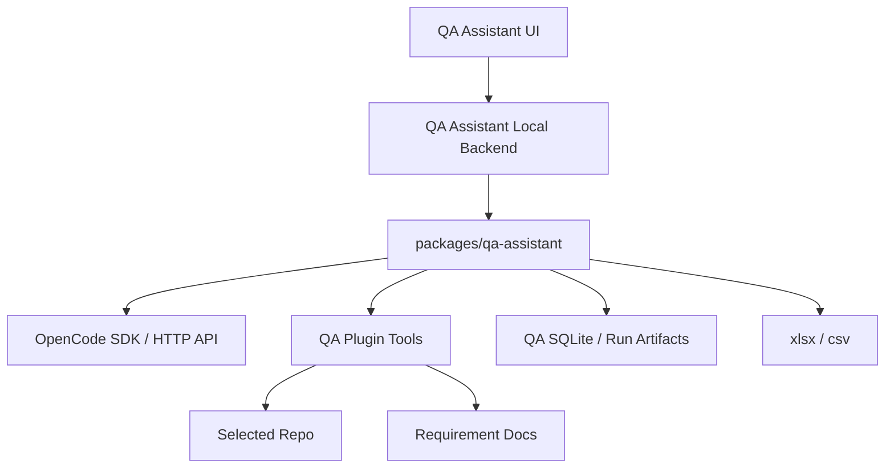

# OpenCode Learning Path for QA Assistant Development

这份文档用于帮助二开同学系统理解 OpenCode 的实现细节。建议先按整体架构建立地图，再按路线深入不同模块，最后回到 QA Assistant 的二开落点，判断哪些能力应该做成独立 package、插件、Agent 工具或薄 adapter。

## 学习目标

完成这套路径后，你应该能回答：

- OpenCode 从 CLI、Web、Desktop 到 server/runtime 的整体调用链是什么。
- 一次用户 prompt 如何变成 Session、消息、LLM 请求、工具调用和最终响应。
- 配置、Provider、Agent、Skill、Plugin、MCP、Permission 如何组合进一次模型调用。
- Web UI、Desktop shell、TUI 和 HTTP API 分别承担什么职责。
- 二开 QA Assistant 时应该接入哪些扩展点，应该避免改哪些核心文件。
- 官方 `dev` 更新后，哪些目录最容易冲突，如何快速定位影响。

## 总体地图

OpenCode 采用 monorepo 结构。理解时先按“产品入口 -> runtime/server -> core/domain -> UI shell -> shared packages”看。

```text
packages/opencode
  CLI、server、runtime、session、tool、provider、config、plugin、TUI 等主实现

packages/core
  通用领域模型、数据库、事件、项目、Session V2、工具基础能力、Location 服务

packages/app
  Solid Web UI，既可被 web 使用，也被 Desktop webview 使用

packages/desktop
  Electron 主进程、sidecar server、窗口、IPC、系统集成

packages/plugin
  插件作者 API，包括 server plugin、tool、TUI plugin 类型

packages/server
  V2 HTTP API 的 schema、handler 和 middleware

packages/llm
  原生 LLM 协议、provider route、transport、工具事件 schema

packages/sdk/js
  由 OpenAPI 生成的 JS SDK

packages/ui
  共享 UI 组件、主题、字体、Markdown/file 渲染能力
```

最重要的运行时关系：

```text
CLI / Web UI / Desktop / TUI
  -> OpenCode HTTP API 或 in-process runtime
  -> SessionPrompt / Session Runner
  -> Agent + Config + Provider + ToolRegistry + Plugin + MCP + Permission
  -> LLM stream
  -> Tool execution
  -> Session messages / events / storage
  -> UI event replay and rendering
```

## 第一阶段：整体架构入门

目标：先建立目录和启动路径，不急着读细节。

阅读顺序：

1. `package.json`
   - 看 workspace、顶层 scripts、Bun 版本和测试约束。
   - 记住测试不能从 repo root 跑。

2. `packages/opencode/package.json`
   - 看 `bin`、`exports`、`dev`、`typecheck`、核心依赖。
   - 认识 `opencode` 这个 package 是主 runtime。

3. `packages/opencode/src/index.ts`
   - 这是 CLI 总入口。
   - 重点看 yargs command 注册、全局日志初始化、异常处理。

4. `packages/opencode/src/cli/effect-cmd.ts`
   - 认识命令如何挂到 Effect runtime。
   - 理解 `instance` 参数：哪些命令需要加载项目 InstanceContext。

5. `packages/opencode/src/server/server.ts`
   - 认识 HTTP server 如何启动。
   - 重点看 `listen`、`createRoutes`、mDNS、UI fallback。

6. `packages/opencode/src/server/routes/instance/httpapi/server.ts`
   - 这是 HTTP route layer 的组合中心。
   - 重点看 Root API、Instance API、Event API、PTY WebSocket、V2 API、UI route 如何合并。

7. `packages/core/src/location-layer.ts`
   - 认识 V2 Location-scoped 服务。
   - 这是理解“一个 workspace/location 一套 config、agent、tool、permission、runner”的关键。

产出笔记：

- 画一张从 `opencode run` 到 Session 执行的粗流程图。
- 画一张从 Desktop 启动到 sidecar server 就绪的粗流程图。
- 列出你认为 QA Assistant 需要复用的公共能力。

## 第二阶段：主链路深挖

目标：完整理解“一次用户输入如何被执行”。

### 路线 A：CLI 和交互入口

适合了解命令行、TUI、非交互运行和 attach 模式。

阅读路径：

```text
packages/opencode/src/index.ts
packages/opencode/src/cli/effect-cmd.ts
packages/opencode/src/cli/cmd/run.ts
packages/opencode/src/cli/cmd/run/runtime.ts
packages/opencode/src/cli/cmd/run/stream.ts
packages/opencode/src/cli/cmd/run/stream.transport.ts
packages/opencode/src/cli/cmd/run/session-data.ts
packages/opencode/src/cli/cmd/tui/app.tsx
packages/opencode/src/cli/cmd/tui/event.ts
packages/opencode/src/cli/cmd/tui/keymap.tsx
```

重点问题：

- `opencode run` 如何决定本地 runtime 还是 attach 到远端 server。
- interactive 和 non-interactive 的输出流差异是什么。
- CLI 如何创建、恢复、fork、share Session。
- TUI 如何接收事件并更新显示。

二开意义：

- QA Assistant 的 CLI 原型可以借鉴 `RunCommand` 的参数组织，但不要直接塞进 `run` 命令。
- 如果要新增 `qa-assistant` CLI，优先独立 package 或新增小命令入口，避免污染主 `run` 流程。

### 路线 B：HTTP API、SDK 和事件流

适合了解 Web UI、Desktop、外部集成如何调用 OpenCode。

阅读路径：

```text
packages/opencode/src/server/server.ts
packages/opencode/src/server/routes/instance/httpapi/api.ts
packages/opencode/src/server/routes/instance/httpapi/server.ts
packages/opencode/src/server/routes/instance/httpapi/groups/session.ts
packages/opencode/src/server/routes/instance/httpapi/handlers/session.ts
packages/opencode/src/server/routes/instance/httpapi/groups/event.ts
packages/opencode/src/server/routes/instance/httpapi/handlers/event.ts
packages/server/src/api.ts
packages/server/src/groups/v2/session.ts
packages/server/src/handlers/v2/session.ts
packages/sdk/js
```

重点问题：

- Root API、Instance API、V2 API 分别负责什么。
- `session.prompt` 和 `session.promptAsync` 的差别是什么。
- SSE / event replay 如何让 UI 追踪 Session 变化。
- OpenAPI 如何进入 SDK 生成流程。

二开意义：

- QA Assistant 桌面端可以先调用本地 Node 后端或 OpenCode HTTP API。
- 如果未来要暴露 QA API，优先新增独立 API group 或独立 service，不要改已有 Session API 语义。
- 修改 API route 前必须做影响分析，因为 Web UI、Desktop、SDK 都可能依赖响应 shape。

### 路线 C：Session、消息、LLM 和工具调用

这是最核心路线。建议反复读，二开 Agent 能力大多会落在这里的边界附近。

阅读路径：

```text
packages/opencode/src/session/session.ts
packages/opencode/src/session/message-v2.ts
packages/opencode/src/session/prompt.ts
packages/opencode/src/session/processor.ts
packages/opencode/src/session/llm.ts
packages/opencode/src/session/llm/request.ts
packages/opencode/src/session/tools.ts
packages/opencode/src/tool/registry.ts
packages/opencode/src/tool/tool.ts
packages/opencode/src/tool/read.ts
packages/opencode/src/tool/grep.ts
packages/opencode/src/tool/glob.ts
packages/opencode/src/tool/write.ts
packages/opencode/src/tool/edit.ts
packages/opencode/src/tool/apply_patch.ts
packages/opencode/src/permission
packages/opencode/src/session/compaction.ts
packages/opencode/src/session/summary.ts
```

关键链路：

```text
HTTP/CLI prompt
  -> SessionPrompt.prompt
  -> createUserMessage
  -> SessionPrompt.loop
  -> runLoop
  -> resolve agent/model/messages/tools/system prompts
  -> SessionProcessor.create
  -> LLM.stream
  -> stream events
  -> tool calls
  -> SessionTools.resolve
  -> ToolRegistry.tools
  -> tool execute
  -> update Session parts
  -> continue/stop/compact
```

重点问题：

- User message、assistant message、part、tool part 的数据结构是什么。
- `SessionPrompt.run` 如何判断继续、停止、compaction 或 subtask。
- `SessionProcessor` 如何把 LLM stream 转成 text、reasoning、tool、error、usage。
- `SessionTools.resolve` 如何把 built-in tool、plugin tool、MCP tool 变成 AI SDK tools。
- Permission 是在哪里被 ask、allow、deny 的。
- `MessageV2.toModelMessagesEffect` 如何把历史消息转成模型上下文。

二开意义：

- QA Assistant 的生成流水线不应修改 `SessionPrompt.run`。
- QA Agent 更适合通过独立 Agent 配置、工具注册、插件或外部 CLI 调用 OpenCode runtime。
- 如果需要结构化输出，先研究 `json_schema` format 和 `StructuredOutput` 工具，而不是自定义消息结构。

### 路线 D：Config、Agent、Provider、Auth、Plugin、Skill、MCP

适合了解“模型调用前的上下文从哪里来”。

阅读路径：

```text
packages/opencode/src/config/config.ts
packages/opencode/src/config/agent.ts
packages/opencode/src/config/plugin.ts
packages/opencode/src/agent/agent.ts
packages/opencode/src/provider/provider.ts
packages/opencode/src/provider/auth.ts
packages/opencode/src/auth
packages/opencode/src/plugin/index.ts
packages/opencode/src/plugin/loader.ts
packages/opencode/src/plugin/shared.ts
packages/plugin/src/index.ts
packages/plugin/src/tool.ts
packages/plugin/src/tui.ts
packages/opencode/src/skill
packages/opencode/src/tool/skill.ts
packages/opencode/src/mcp
```

重点问题：

- 全局 config、项目 config、远程 config 如何合并。
- Agent 的 mode、permission、prompt、tools 如何决定行为。
- Provider 如何从 config、auth、env、models.dev 组合出可用模型。
- Plugin 是如何从 config spec resolve、install、load 的。
- Server plugin、tool plugin、TUI plugin 的边界是什么。
- Skill 如何被发现、注入、作为工具调用。

二开意义：

- QA Assistant 应优先通过独立 Agent、tool、plugin 注册能力接入。
- QA 专属配置使用独立 namespace，例如 `qa_assistant`，不要扩散到通用 config 字段。
- 如果需要自定义工具，先走 plugin tool API，再考虑改 `ToolRegistry`。

### 路线 E：Core V2、Location、Storage 和事件

适合了解后续官方演进方向，以及哪些地方容易在同步官方时变动。

阅读路径：

```text
specs/v2/session.md
specs/v2/config.md
specs/v2/provider-model.md
packages/core/src/location.ts
packages/core/src/location-layer.ts
packages/core/src/session.ts
packages/core/src/session/input.ts
packages/core/src/session/store.ts
packages/core/src/session/projector.ts
packages/core/src/session/event.ts
packages/core/src/session/execution.ts
packages/core/src/session/run-coordinator.ts
packages/core/src/session/runner/index.ts
packages/core/src/session/runner/llm.ts
packages/core/src/database/database.ts
packages/core/src/database/schema.sql.ts
packages/core/src/event.ts
packages/core/src/event/sql.ts
```

重点问题：

- V1 Session 和 V2 Session 当前如何并存。
- durable `session_input` 和 projected visible messages 的区别是什么。
- `SessionExecution.resume/wake` 和 `SessionRunCoordinator` 解决什么问题。
- Location-scoped service 为什么对多 workspace / 多 placement 重要。
- Event V2 如何持久化、投影和 replay。

二开意义：

- 长期看，二开能力应尽量对齐 V2 的 Location-scoped 方向。
- QA Assistant 的历史记录可以独立存储，但如果要和 OpenCode Session 关联，应该通过 Session ID 和 metadata 关联，不要直接改核心 session 表。
- 不要把 QA 生成流水线塞进 V2 runner，除非官方已经提供通用扩展点。

### 路线 F：Web UI

适合了解页面、状态、SDK、事件同步和交互组件。

阅读路径：

```text
packages/app/src/app.tsx
packages/app/src/pages/layout.tsx
packages/app/src/pages/home.tsx
packages/app/src/pages/session.tsx
packages/app/src/pages/directory-layout.tsx
packages/app/src/context/server.tsx
packages/app/src/context/server-sdk.tsx
packages/app/src/context/sdk.tsx
packages/app/src/context/sync.tsx
packages/app/src/context/server-sync.tsx
packages/app/src/context/prompt.tsx
packages/app/src/context/permission.tsx
packages/app/src/context/file.tsx
packages/app/src/components/prompt-input.tsx
packages/app/src/components/file-tree.tsx
packages/app/src/components/terminal.tsx
```

重点问题：

- App provider tree 如何组织 server、SDK、settings、permission、layout。
- UI 如何选择 server 并创建 directory-scoped SDK。
- Session 页面如何读取消息、发送 prompt、订阅事件。
- Permission 弹窗和工具状态如何呈现。

二开意义：

- QA Assistant 的桌面 UI 如果复用 Web UI，应新增独立 route/page，而不是改 `session.tsx`。
- 表格编辑、导出、历史记录等 QA 页面应保持自有 context，避免污染现有 Session UI state。

### 路线 G：Desktop Electron

适合了解本地应用、sidecar、IPC、窗口、系统权限和打包。

阅读路径：

```text
packages/desktop/src/main/index.ts
packages/desktop/src/main/server.ts
packages/desktop/src/main/sidecar.ts
packages/desktop/src/main/ipc.ts
packages/desktop/src/main/windows.ts
packages/desktop/src/main/menu.ts
packages/desktop/src/preload/index.ts
packages/desktop/src/preload/types.ts
packages/desktop/src/renderer/index.tsx
packages/desktop/electron-builder.config.ts
```

关键链路：

```text
Electron main
  -> prefer app env
  -> spawn sidecar server
  -> wait /global/health
  -> create BrowserWindow
  -> preload exposes safe APIs
  -> renderer loads shared app
```

重点问题：

- sidecar server 如何启动、停止和做健康检查。
- preload 暴露了哪些 API 给 renderer。
- Desktop 如何处理 deep link、菜单、日志、更新、系统证书。
- Desktop app 和 Web app 之间如何共享 `packages/app`。

二开意义：

- QA Assistant MVP 如果是 Electron 优先，应复用 Desktop 的 sidecar 模式和本地文件能力。
- 新增本地文档选择、仓库选择、导出路径时，优先通过 preload/IPC 暴露最小能力。
- 不要让 renderer 直接拥有过大的文件系统权限。

### 路线 H：LLM 原生协议和 Provider 路由

适合了解模型请求细节、协议差异、工具流和未来性能优化。

阅读路径：

```text
packages/llm/src/index.ts
packages/llm/src/llm.ts
packages/llm/src/provider.ts
packages/llm/src/schema/events.ts
packages/llm/src/schema/messages.ts
packages/llm/src/tool.ts
packages/llm/src/tool-runtime.ts
packages/llm/src/route/client.ts
packages/llm/src/route/executor.ts
packages/llm/src/route/transport/http.ts
packages/llm/src/route/transport/websocket.ts
packages/llm/src/protocols/openai-responses.ts
packages/llm/src/protocols/anthropic-messages.ts
packages/llm/src/protocols/gemini.ts
packages/llm/src/protocols/bedrock-converse.ts
```

重点问题：

- LLMEvent schema 如何表达 text、reasoning、tool call、usage、finish。
- Native runtime 和 AI SDK runtime 的差异是什么。
- Provider-specific options 如何被转换和下发。
- 工具调用流式事件如何归一化。

二开意义：

- QA Assistant v0.1 不建议直接改 LLM protocol。
- 如果遇到结构化输出稳定性问题，先在 Agent prompt、schema 校验、重试和审查阶段解决。

## 第三阶段：按二开任务反向学习

当你开始做 QA Assistant，不要平均阅读全部模块。按任务倒推需要深入的路线。

### 任务 1：做 CLI 原型

优先阅读：

```text
packages/opencode/src/index.ts
packages/opencode/src/cli/effect-cmd.ts
packages/opencode/src/cli/cmd/run.ts
packages/opencode/src/config/config.ts
packages/opencode/src/tool/registry.ts
packages/plugin/src/tool.ts
```

实现建议：

- 新建 `packages/qa-assistant` 或同等隔离 package。
- CLI 先独立为 `qa-assistant`，不要改 `opencode run`。
- 通过 OpenCode SDK、server API 或 plugin tool 调用复用能力。

### 任务 2：定义 QA Agent 和工具

优先阅读：

```text
packages/opencode/src/agent/agent.ts
packages/opencode/src/session/prompt.ts
packages/opencode/src/session/tools.ts
packages/opencode/src/tool/registry.ts
packages/plugin/src/tool.ts
packages/opencode/src/permission
```

实现建议：

- QA 工具先做成 plugin tools：`read_requirement_doc`、`repo_tree`、`search_code`、`read_code_files`、`export_testcases`。
- 工具内部严格限制路径范围。
- 通过 schema 校验保证输出结构，不修改 Session 消息模型。

### 任务 3：做 Electron MVP

优先阅读：

```text
packages/desktop/src/main/index.ts
packages/desktop/src/main/server.ts
packages/desktop/src/main/ipc.ts
packages/desktop/src/preload/types.ts
packages/app/src/app.tsx
packages/app/src/pages/layout.tsx
packages/app/src/context/server-sdk.tsx
```

实现建议：

- 新增 QA 页面和最小导航入口。
- 文件选择、目录选择、导出路径通过 IPC。
- 生成流程放在本地后端或独立 package，不放在 renderer。

### 任务 4：保存历史记录

优先阅读：

```text
packages/core/src/database/database.ts
packages/core/src/database/schema.sql.ts
packages/core/src/session/sql.ts
packages/opencode/src/storage
packages/opencode/src/session/session.ts
```

实现建议：

- QA 历史记录优先独立 SQLite 文件或独立表前缀。
- 用 OpenCode Session ID 做弱关联，不要把 QA 字段塞进核心 session 表。
- 中间结果保存在 run 目录，数据库只保存索引和摘要。

### 任务 5：接入 OpenCode HTTP API

优先阅读：

```text
packages/opencode/src/server/routes/instance/httpapi/api.ts
packages/opencode/src/server/routes/instance/httpapi/server.ts
packages/opencode/src/server/routes/instance/httpapi/groups/session.ts
packages/opencode/src/server/routes/instance/httpapi/handlers/session.ts
packages/server/src/api.ts
packages/sdk/js
```

实现建议：

- 先作为 OpenCode API 的调用方，不新增 route。
- 如果必须新增 route，新增独立 QA API group，并同步 SDK 生成流程。
- 修改 API 前先做 route consumer 影响分析。

## 建议阅读排期

### 第 1 天：跑通和总览

- 阅读 root `package.json`、`packages/opencode/package.json`。
- 阅读 `packages/opencode/src/index.ts`。
- 阅读 `packages/opencode/src/cli/effect-cmd.ts`。
- 阅读 `packages/opencode/src/server/server.ts`。
- 输出一张入口架构图。

### 第 2 到 3 天：Session 主链路

- 精读 `packages/opencode/src/session/prompt.ts`。
- 精读 `packages/opencode/src/session/processor.ts`。
- 精读 `packages/opencode/src/session/llm.ts`。
- 精读 `packages/opencode/src/session/tools.ts`。
- 输出一次 prompt 的时序图。

### 第 4 天：工具、权限、插件

- 阅读 `packages/opencode/src/tool/registry.ts`。
- 选 3 个内置工具读实现：`read.ts`、`grep.ts`、`apply_patch.ts`。
- 阅读 `packages/plugin/src/tool.ts`。
- 阅读 `packages/opencode/src/plugin/loader.ts`。
- 输出 QA 工具接入方案。

### 第 5 天：配置、Provider、Agent

- 阅读 `packages/opencode/src/config/config.ts`。
- 阅读 `packages/opencode/src/agent/agent.ts`。
- 阅读 `packages/opencode/src/provider/provider.ts`。
- 输出 QA Agent 配置草案。

### 第 6 到 7 天：Web 和 Desktop

- 阅读 `packages/app/src/app.tsx`。
- 阅读 `packages/app/src/context/server-sdk.tsx` 和 `sdk.tsx`。
- 阅读 `packages/desktop/src/main/index.ts`。
- 阅读 `packages/desktop/src/main/server.ts`。
- 输出 QA Assistant Electron MVP 页面与 IPC 边界。

### 第 2 周：V2 和二开稳定性

- 阅读 `specs/v2/session.md`。
- 阅读 `packages/core/src/location-layer.ts`。
- 阅读 `packages/core/src/session/run-coordinator.ts`。
- 阅读 `packages/core/src/session/runner/*`。
- 输出“哪些地方不碰、哪些地方做 adapter”的二开边界清单。

## 验证练习

每条路线读完后做一个小练习，避免只看文件名。

- CLI：新增一个临时 debug command 草案，不提交实现，只写出需要挂载的文件。
- Session：手写一次 prompt 到 tool call 的时序图。
- Tool：用伪代码写一个只读 `repo_tree` tool 的输入输出和 permission 策略。
- Plugin：判断 QA tools 用 file plugin、npm plugin 还是内置 registry 更合适。
- Desktop：写出“选择需求文档 -> 后端解析 -> UI 展示摘要”的 IPC/HTTP 边界。
- Storage：设计 QA 历史记录和 OpenCode Session 的关联方式。
- Sync：列出本次二开可能碰到的官方高冲突文件。

## 推荐画的图

### OpenCode 主链路



### Desktop 主链路



### QA Assistant 推荐接入



## 二开红线

优先不要修改：

- `packages/opencode/src/session/prompt.ts`
- `packages/opencode/src/session/processor.ts`
- `packages/opencode/src/session/llm.ts`
- `packages/opencode/src/server/routes/instance/httpapi/handlers/session.ts`
- `packages/core/src/session/*`
- `packages/core/src/database/schema.sql.ts`

如果必须修改，先确认：

- 是否可以通过独立 package 实现。
- 是否可以通过 plugin tool 实现。
- 是否可以通过新增 adapter 实现。
- 是否可以通过新增通用扩展点实现。
- 是否需要同步 SDK。
- 是否会影响 Web UI、Desktop、TUI、CLI 或外部 API。

## 二开优先落点

推荐：

```text
packages/qa-assistant/
  src/cli
  src/agent
  src/tools
  src/requirement
  src/repo
  src/export
  src/storage
  src/pipeline

specs/qa-assistant/
  planning/
    qa-assistant-v0.1.md
  learning/
    opencode-learning-path.md
  operations/
    sync-upstream.md
  prompts/
    prompt-rules.md
```

需要接入官方 OpenCode 时，优先：

- 新增插件。
- 新增独立 CLI。
- 新增 Desktop 独立页面。
- 新增薄 adapter。
- 调用 SDK 或 HTTP API。

最后才考虑修改 core session、LLM、tool registry 或 HTTP session handler。

## 常用命令

从对应 package 目录执行：

```bash
cd packages/opencode
bun typecheck
bun test
```

```bash
cd packages/app
bun typecheck
bun test:unit
```

```bash
cd packages/desktop
bun typecheck
bun dev
```

根目录只适合做 workspace 级别检查，不要从 root 跑测试：

```bash
bun run typecheck
git diff --check
```

如果修改 SDK 相关 API：

```bash
./packages/sdk/js/script/build.ts
```

## 后续维护建议

- 每次深入一个模块，都把新的理解补回这份文档。
- 每次官方同步后，把冲突和解决方式记录到 `specs/qa-assistant/operations/sync-upstream.md`。
- 每次准备改官方核心文件前，先在文档中写下“为什么不能用插件/adapter/独立 package”。
- 每个 QA Assistant 功能都先判断它属于“产品业务逻辑”还是“OpenCode 通用扩展点”。前者留在 QA 包，后者才考虑向官方抽象。
